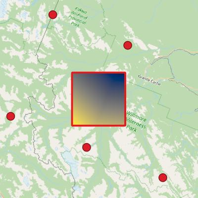

# WeatherFetch
WeatherFetch automatically downloads climatic variables and outputs them in analysis-ready spatial formats.



## Usage
All functions contain docstrings documenting their use. Some examples are provided below.

To download a dataset, apply a spatial filter, and save to CSV,
```py
# Download a file
from weatherfetch.earthaccess_fetch import search_download_merra2
output_dir = './Test/'
dataset = 'M2SDNXSLV'
bbox = (-114.3, 53.4, -113.4, 54.0)
dates = ('2001-01-01', '2001-01-02')

downloaded_files = search_download_merra2(output_dir, 
                                          dataset, 
                                          bbox, 
                                          dates, 
                                          verbose = True)

# Apply spatial filters
from weatherfetch.point_ops import nearest_n_points, points_within_d
nc4_file_path = downloaded_files[0]
variable = 'T2MMAX'
point = (-113.5, 53.5)

## Find the nearest 'n' points
nearest_n_points(nc4_file_path, 
                 variable, 
                 point,
                 n_pts = 10,
                 output_csv_path = './Test/test_n.csv', 
                 output_shp_path = './Test/test_n.shp',
                 )
## Find points within a distance
points_within_d(nc4_file_path, 
                variable, 
                point, 
                d = 1000, # Metres 
                output_csv_path = './Test/test_n.csv', 
                output_shp_path = './Test/test_n.shp',
                )
```
To interpolate data and save as a raster,
```py
from weatherfetch.array_ops import ProcessingOptions, interpolate_in_bbox
nc4_file_path = downloaded_files[0]
variable = 'T2MMAX'
bbox = (-114.3, 53.4, -113.4, 54.0)
output_path = './Test/'
resolution = 100  # metres

processing_options = ProcessingOptions(variable=variable,
                                       bbox=bbox,
                                       resolution=resolution,
                                       mode='daily',  # daily, hour, or avg_hourly
                                       n_pts=None,  # Mutually exclusive from d
                                       d=1000,  # Mutually exclusive from n_pts
                                       method='linear',  # Interpolation method
                                       hour=None,  # If mode is hour, the hour to extract data for (e.g., 17:00)
                                       avg_hours=None,  # If mode is avg_hourly, the time step to average over (e.g., 6)
                                       reproj=None,  # {'epsg': EPSG_CODE, 'bbox': transformed_bbox} if output GeoTIFF should be reprojected
                                       convert_h5=False)  # Whether to output in HDF5 format instead of GeoTIFF

interpolate_in_bbox(nc4_file_path,
                    output_path,
                    processing_options)
```


## Installation
1. Clone this package
2. Navigate to the cloned directory
3. Call `python setup.py develop` to install this package in developer mode
